# 快手AI平台前端开发面经

**发布时间**: 2026-04-08 13:52
**公众号**: React中文社区
**原文链接**: https://mp.weixin.qq.com/s/2O5YP9zF6jBst1VfG3uCcg

---

## 文章内容

这篇文章以长图形式展示，共 11 张图片。

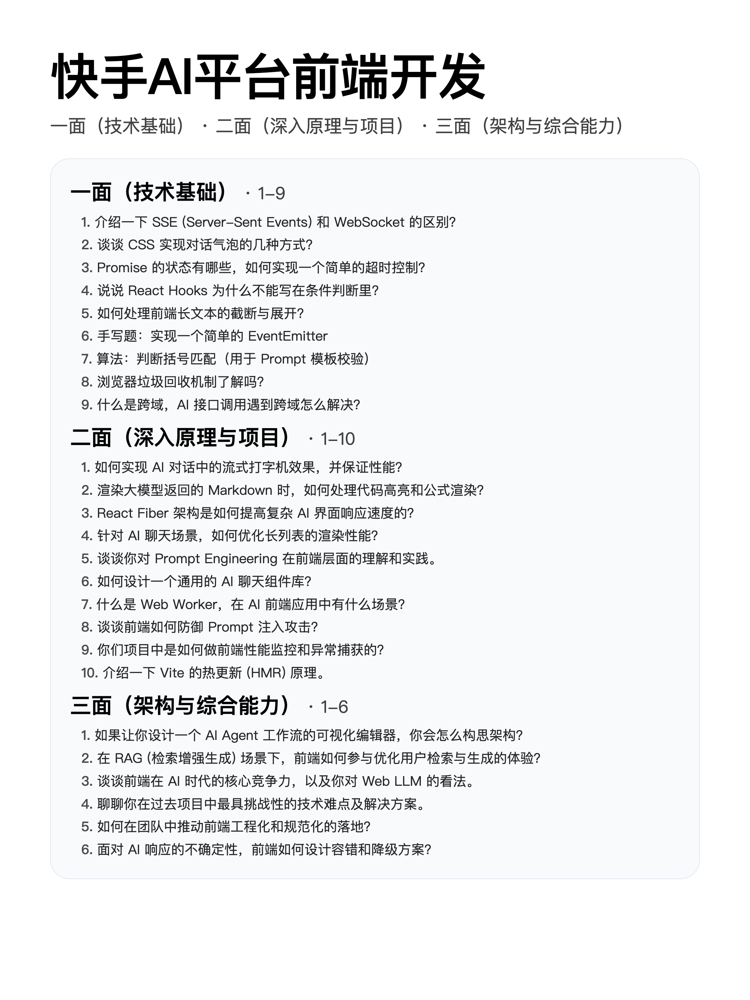

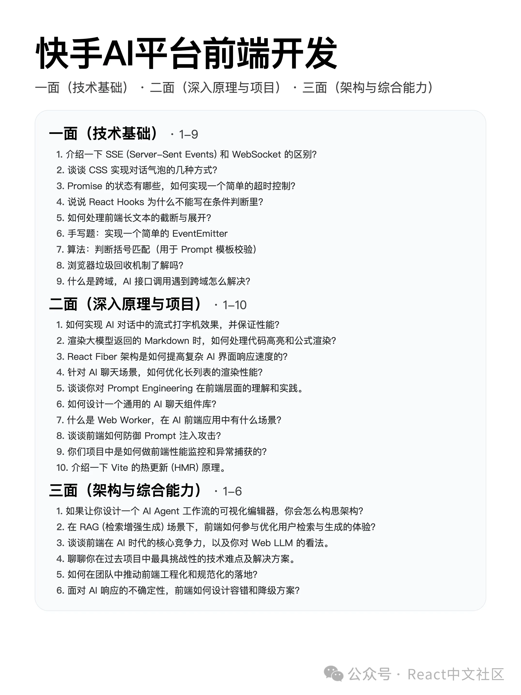

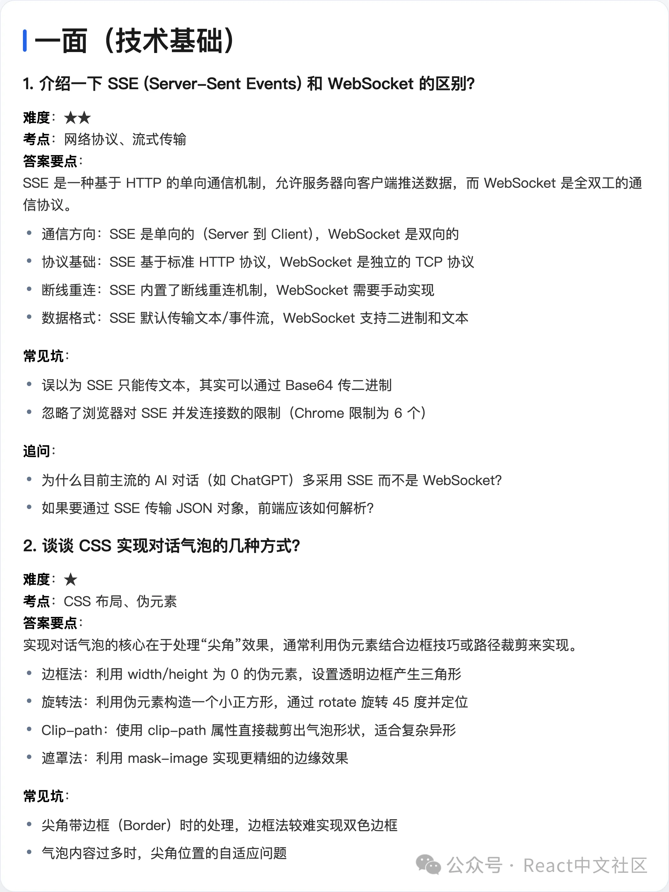

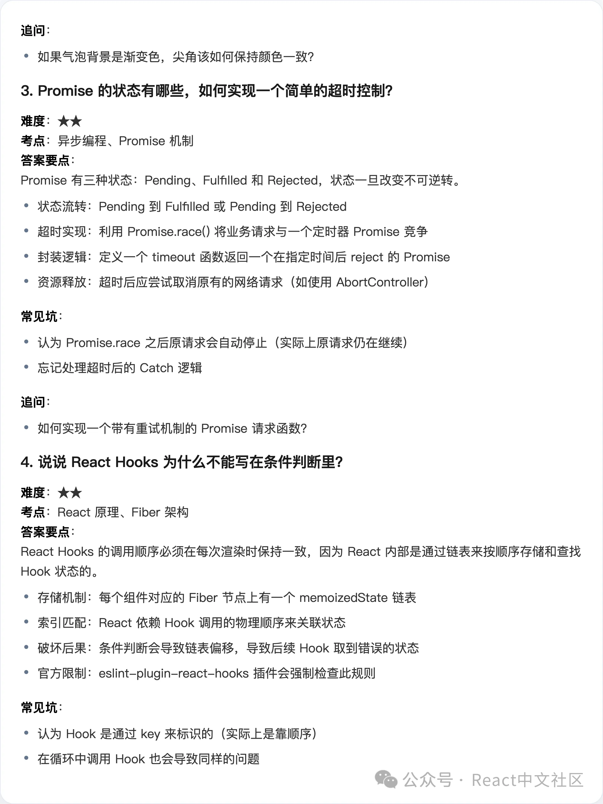

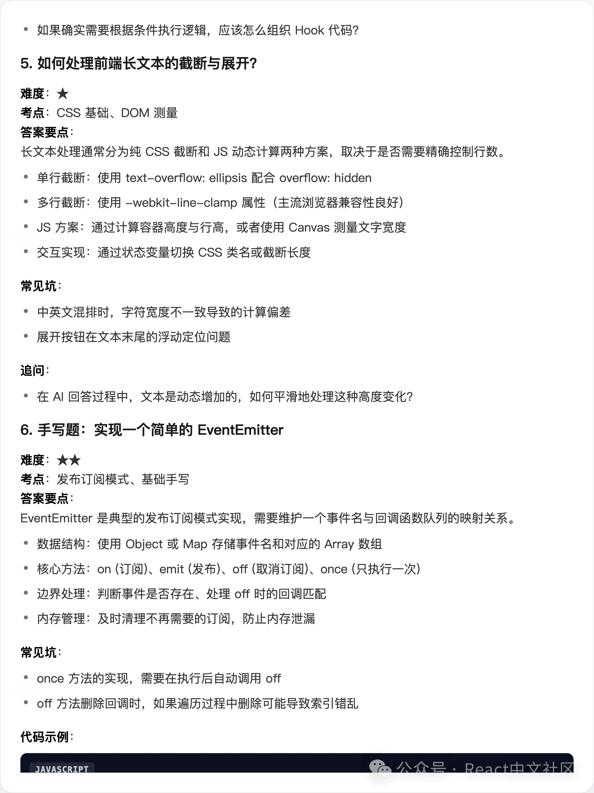

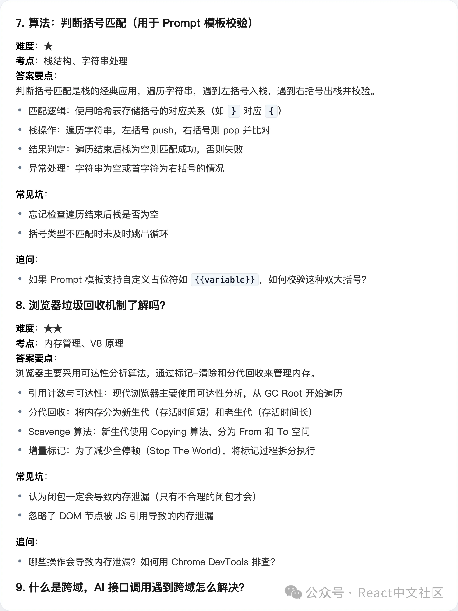

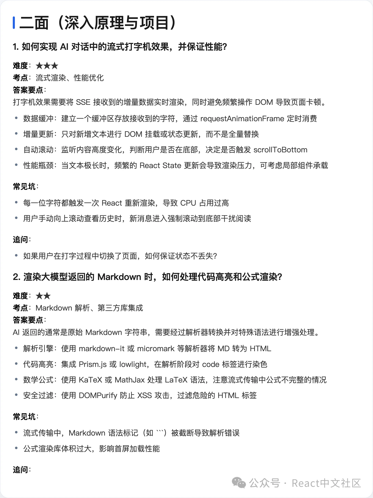

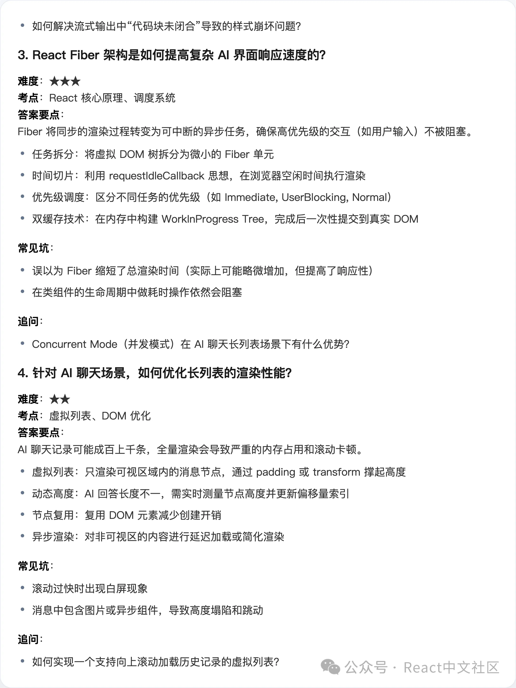

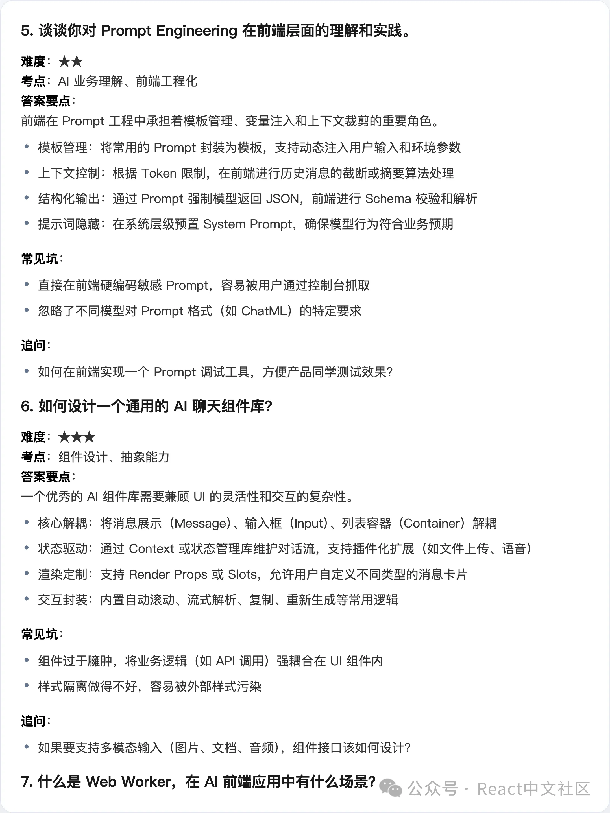

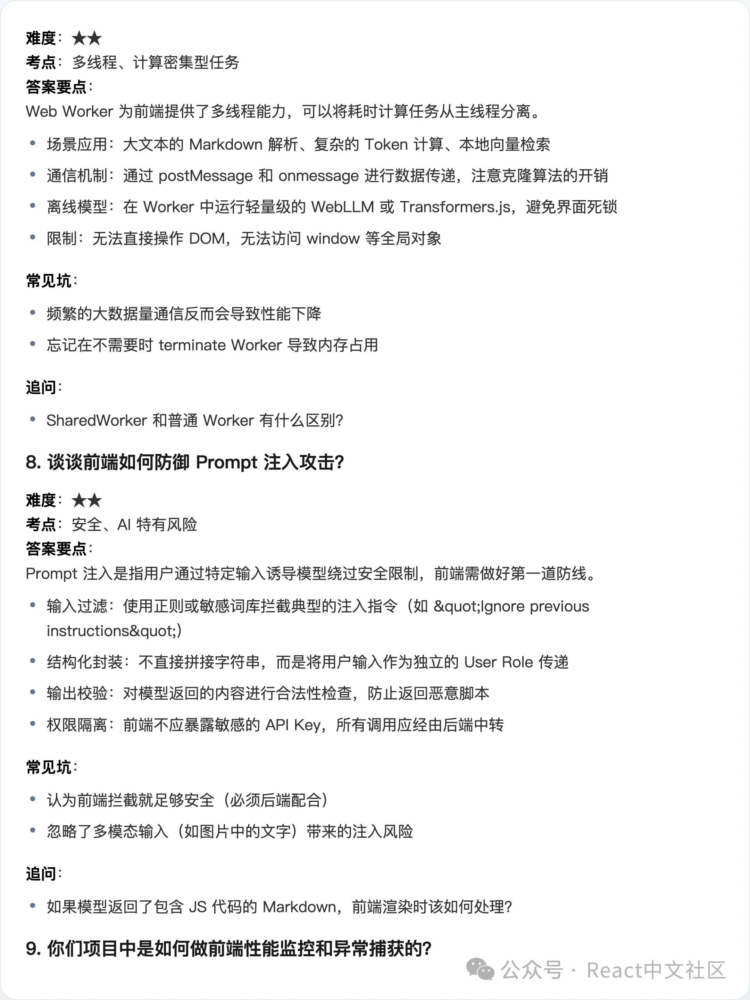

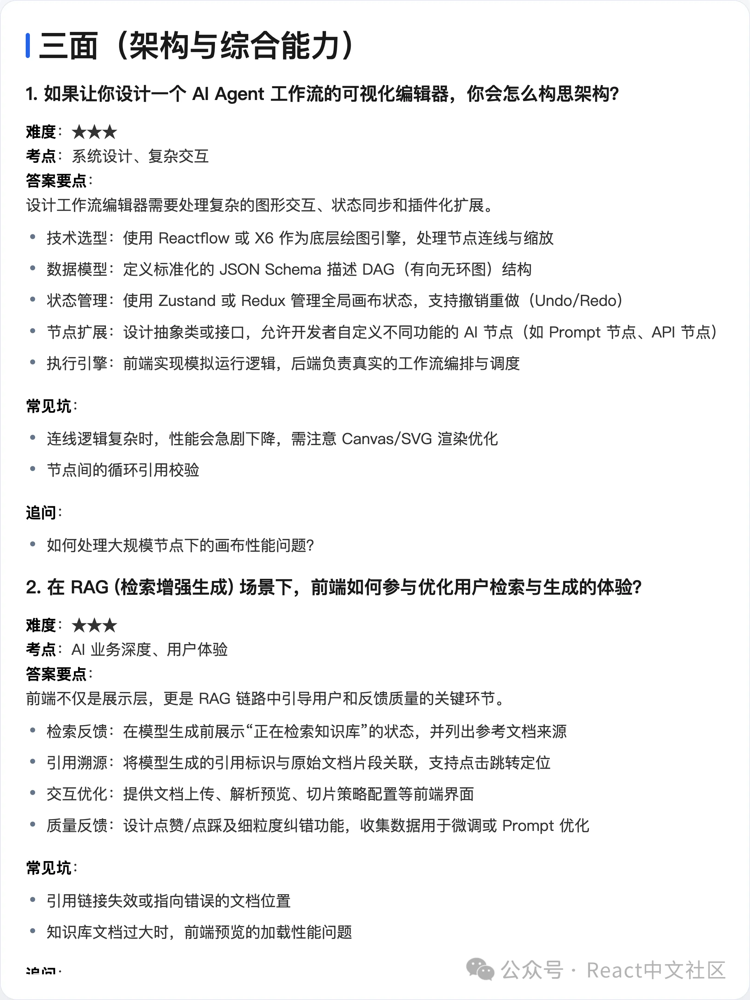

---

## 说明

本文采用长图形式展示内容，如需提取文字内容，可以使用 OCR 工具识别图片中的文字。

**提取方法：**
1. 使用在线 OCR 工具：如 https://www.ocr.space
2. 使用本地 OCR 工具：
   - macOS: 文字识别（右键点击图片 -> 查看描述）
   - Python: 安装 `pytesseract` 和 `tesseract-ocr`

**技术提示：**
```bash
# 安装 Python OCR 库
pip install pytesseract pillow

# 安装 tesseract (macOS)
brew install tesseract

# 运行 OCR 识别
python3 -c "
from PIL import Image
import pytesseract

image = Image.open('快手AI平台前端开发面经_1.png')
text = pytesseract.image_to_string(image, lang='chi_sim+eng')
print(text)
"
```
